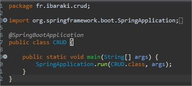
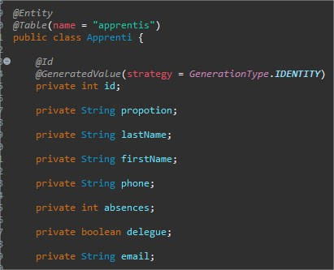
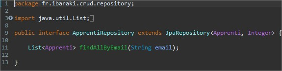
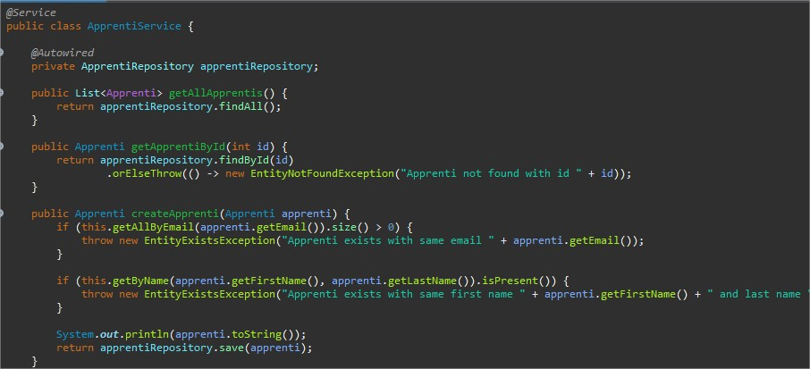
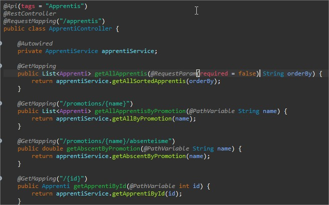
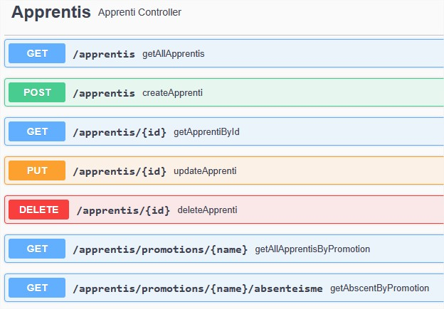
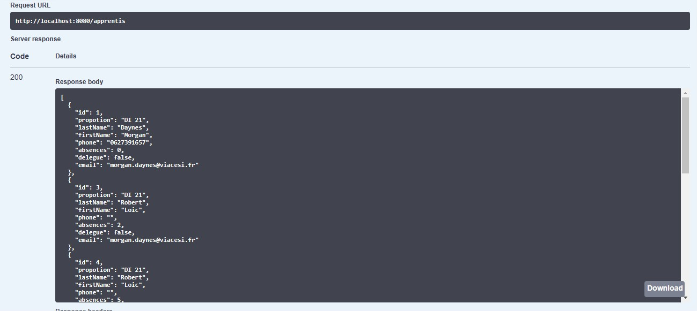
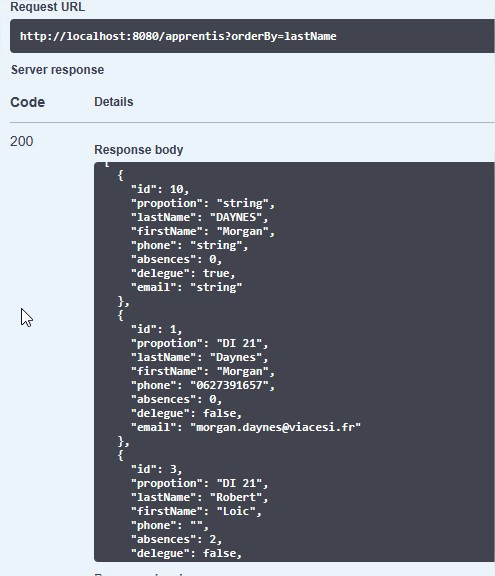
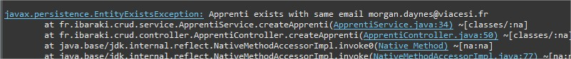

J'ai utilisé le framework Spring Boot pour pouvoir avoir un CRUD fonctionnel et une interface graphique pour tester les fonctionnalités (Swagger).

CODE :

Classe principale d'initialisation Spring Boot

Classe de la définition d'un apprenti

Classe d'accès a la base de donnée (éléments de base gérer par Spring boot)

Classe de logique métier (services)

Classe de gestion des endpoints de l'API

Maintenant qu'on a toutes les classes on peut passer aux test via Swagger.

J'ai testé pour le readme le getAll

Ensuite le getAllByOrder

Pour finir l'erreur de création avec le même email

Pour tester le programme il vous faut une BBD MySQL et modifier/créer la bonne configuration dans `application.properties`. De plus il faut installer les prérequis Spring Boot pour l'IDE.